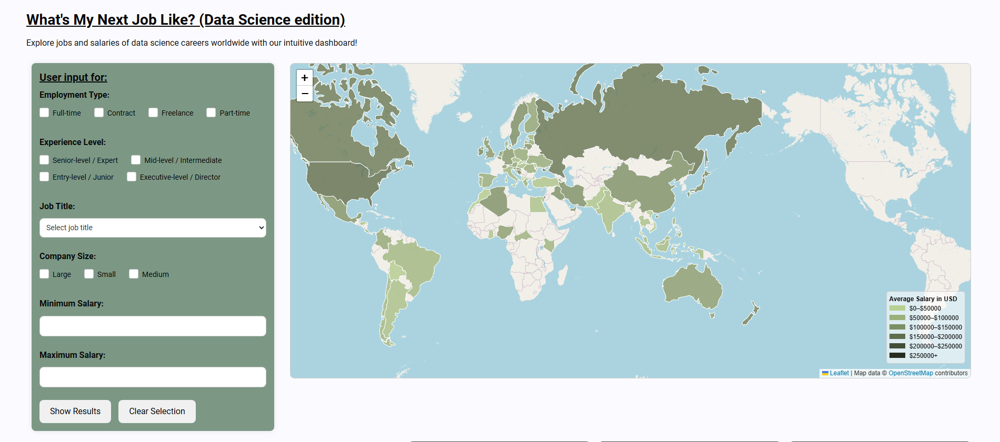
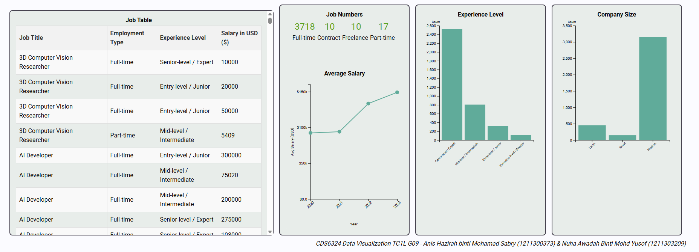

# What’s My Next Job Like? (Data Science edition)
> CDS6324 Data Visualization Project || Year 3 Trimester 2

# Project Members
1. Anis Hazirah Binti Mohamad Sabry
2. Nuha Awadah Binti Mohd Yusof

# Proposed Dataset and Its Attributes
2023 Data Scientists Salary dataset [https://www.kaggle.com/datasets/henryshan/2023-data-scientists-salary]

As a future Data Science graduate, we aim to make a significant contribution to the world with our skills, while also securing a lucrative career. In today’s data-driven economy, data scientists are sought after by many. Yet, just how many of these opportunities will pay us fairly?

This application aims to help guide potential data scientists in exploring their salary expectations across different experiences and job titles. Additionally, the best places to maximize earnings are also highlighted for those who wish to expand their expertise and make informed decisions about their future career path. Whether it’s a fresh graduate or a seasoned expert, this guide aims to help all data scientists worldwide! 
The dataset has 11 attributes, 3700 records, is under the Economy and Growth domain

# Project Description
A comprehensive dashboard like this is useful for someone who is already used to seeing and understanding graphs, which is the targeted audience, data workers. It intends to deliver the information in a clean and concise manner, making sure that information that is of value to the user is presented in an orderly manner. The graphs will be adequately labeled, and the color usage will be coherent. 

# Sample Images

